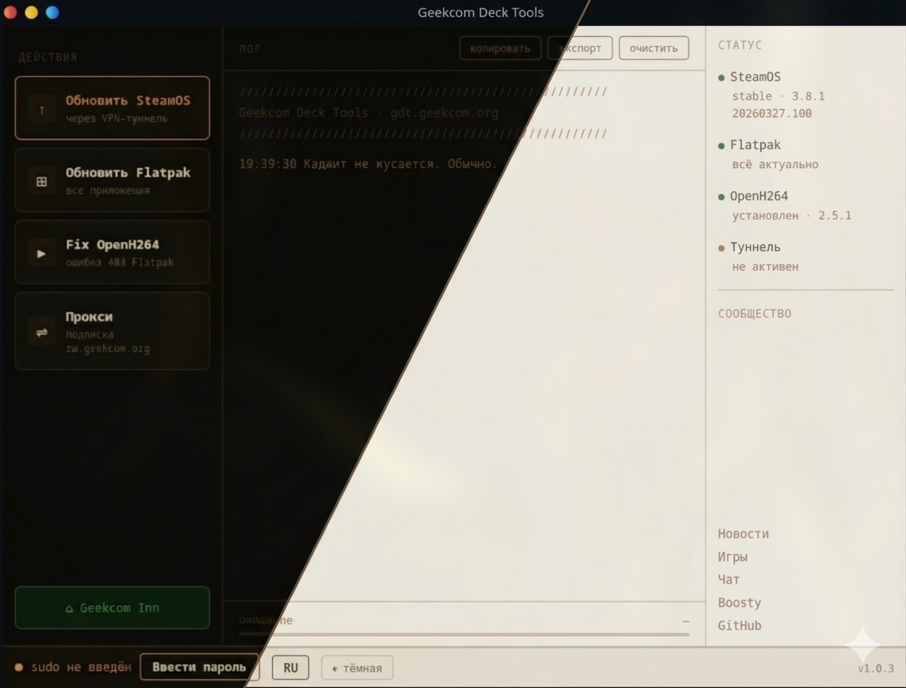

# Geekcom Deck Tools

[English version](README.en.md)



Роскомнадзор заблокировал серверы Valve — Steam Deck не может обновить
SteamOS и скачать приложения из Flatpak. GDT решает эту проблему
автоматически, через временный VPN-туннель.

[](https://t.me/geekcomdeck_news)
[](https://t.me/geekcom_deck_games)
[](https://t.me/Geekcom_hub)
[](https://boosty.to/steamdecks)

## Возможности

- 🔄 **Обновление SteamOS** — через временный VPN-туннель, автоматически
- 📦 **Обновление Flatpak** — все приложения разом, включая системные
- 🎬 **Fix OpenH264** — исправляет ошибку 403 при установке кодека через Flatpak
- 🔒 **Прокси** — постоянный прокси через серверы Geekcom для подписчиков Boosty
- 📊 **Мониторинг системы** — версия SteamOS, ветка обновлений, статус OpenH264, количество ожидающих обновлений Flatpak
- 🌙 **Две темы** — тёмная и светлая
- 🏠 **Geekcom Inn** — SSH-таверна для общения с другими пользователями

> Все сетевые операции выполняются через временный зашифрованный туннель.
> После завершения туннель автоматически закрывается.

## Установка

> [!IMPORTANT]
> GDT работает только в **режиме рабочего стола** Steam Deck.
> Для обновления SteamOS из TTY используйте [NGDT](https://github.com/Nospire/NGDT).

### Требования

- Steam Deck с SteamOS 3.x
- Режим рабочего стола (Desktop Mode)
- Пароль пользователя `deck`

> [!NOTE]
> GDT использует пароль sudo для системных операций: установки обновлений,
> изменения системных файлов и управления Flatpak. Пароль хранится только
> в памяти приложения и не сохраняется на диск.
>
> Если пароль не задан — скрипт установки предложит его создать.
> Задать пароль можно и вручную:
> ```bash
> passwd
> ```

### Установка

Откройте Konsole и выполните:

```bash
curl -fsSL https://gdt.geekcom.org/gdt | bash
```

Скрипт автоматически:
- проверит и установит необходимые зависимости
- скачает GDT и все модули
- создаст ярлык на рабочем столе
- запустит приложение

### Обновление

Для обновления до новой версии выполните ту же команду — или нажмите
на номер версии в интерфейсе GDT, когда появится уведомление.

### Удаление

```bash
rm -rf ~/.scripts/geekcom-deck-tools
rm -f ~/.local/share/applications/gdt.desktop
rm -f ~/Desktop/gdt.desktop
rm -rf ~/.config/gdt
```

## Как это работает

```
Нажимаешь кнопку в GDT
        ↓
GDT запрашивает временный туннель у сервера Geekcom
        ↓
Поднимается зашифрованный VLESS-туннель
        ↓
Системный прокси выставляется автоматически
        ↓
Выполняется нужное действие (обновление, Flatpak и т.д.)
        ↓
Туннель автоматически закрывается
```

Все операции требующие сети (обновление SteamOS, Flatpak, Fix OpenH264)
выполняются через туннель — Роскомнадзор им не помеха.

Прокси-режим работает иначе: туннель остаётся активным пока GDT открыт,
позволяя использовать заблокированные сервисы в браузере и других
приложениях. Доступен подписчикам [Boosty](https://boosty.to/steamdecks).

## Сообщество

Есть вопросы, нашёл баг или просто хочешь пообщаться с такими же
владельцами Steam Deck — добро пожаловать:

| | |
|---|---|
| 📢 Новости | [@geekcomdeck_news](https://t.me/geekcomdeck_news) |
| 🎮 Игры | [@geekcom_deck_games](https://t.me/geekcom_deck_games) |
| 💬 Чат | [@Geekcom_hub](https://t.me/Geekcom_hub) |

## Поддержать проект

GDT — бесплатный инструмент. Серверы, домены и время на разработку
оплачиваются из кармана автора. Если GDT помог тебе — можешь
поддержать проект на Boosty:

[Boosty → boosty.to/steamdecks](https://boosty.to/steamdecks)

Подписчики Boosty получают доступ к **Прокси** — постоянному
зашифрованному туннелю через серверы Geekcom.
